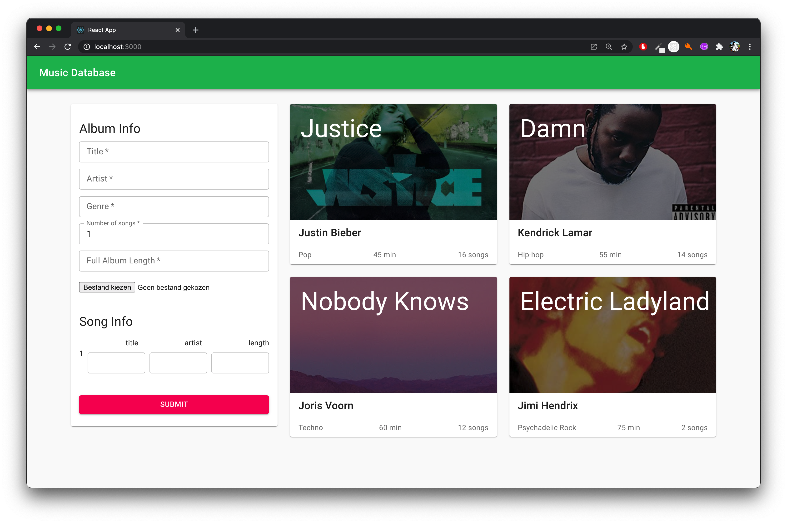

# Music Database

## Introduction
Because I want more knowledge of coding and using databases with coding I make this project. I use a Mongodb database for the storage of the data. Material UI is a nice css framework combined with ReactJS so I was allowed to give all my focus on the code instead of de styling. This repository is part 1 of the application. This is the cliënt version you can find the server with the following [link](#).

## What I use
I use different technologies and frameworks for this application. Below is a list of technologies I use:

- ReactJS: 
Framework for building in components

- Redux
Global state storage

- Material UI
Styling library for React components

- Axios
Send requests to the server

I use also NodeJS and MongoDB but I use that on the server instead of the cliënt.

## Wishlist
- [x] Server/Routing
- [x] Database connection 
- [x] Get data from database
- [x] Send data to the database
- [ ] Delete data from the database
- [ ] Update data from the database
- [ ] Make more routes
- [ ] Spotify API (?)
